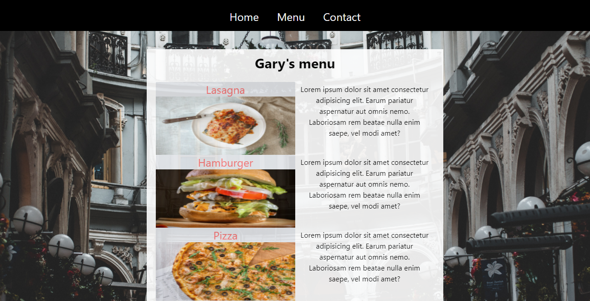

# Js-Restaurant-page

## Table of contents

- [About](#about)
- [Features](#features)
- [Live Demo](#live-demo)
- [Built with](#built-with)
- [Getting started](#getting-started)
  * [Installation instructions](#installation-instructions)
- [Author](#author)
- [Show your support](#show-your-support)
- [Acknowledgements](#acknowledgments)
- [License](#-license)

---

## About

Restaurant page with the pages build entirely with JavaScript and Webpack for modularization




## Features

The features of this project are, user can:

1. page change dynamically
2. Javascript modules.


## Live Demo

This project is hosted on heroku.

[Live demo link](https://helciodev.me/JS-restaurant-page/)


## Built With

- [](https://forthebadge.com)
- [](https://forthebadge.com)
- [](https://forthebadge.com)

## Getting Started


### Installation instructions

Follow along the steps below to get a copy at your local machine.

- Navigate to the directory where you want this project to clone and then clone it

    ```
    git clone git@github.com:helciodev/JS-restaurant-page.git
    ```

- Navigate to the `JS-restaurant-page` directory

    ```
    cd JS-restaurant-page
    ```


## Author

😎 **Helcio André**

- GitHub: [@helciodev](https://github.com/helciodev)
- Twitter: [@helcio_bruno](https://twitter.com/helcio_bruno)
- Linkedin: [Helcio Andre](https://www.linkedin.com/in/helcio-andre/)

## 🤝 Contributing

Contributions, issues, and feature requests are welcome!

## Show your support

Give a ⭐️ if you like this project!

## Acknowledgments

- Images from Pexels [Pexels](https://www.pexels.com//)

## 📝 License

This project is [MIT](./LICENSE) licensed.
